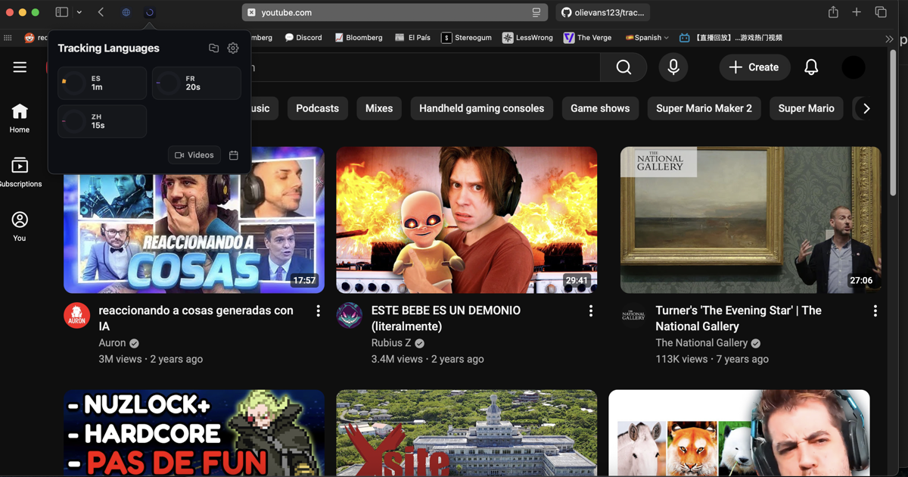

# Tracking Languages for Safari

Safari extension that tracks your YouTube watch time by language. Automatically detects what language you're watching and logs minutes per day, so you can see how much time you're actually spending on language immersion.

## Features

**Automatic Tracking**
- Detects video language from captions, audio metadata, and title analysis
- Tracks watch time per language in 5-second intervals while you watch
- Only counts active viewing — pauses when the tab is hidden or video is paused
- Channel language mapping — manually assign a language to any channel

**Dashboard**
- Progress ring showing daily watch time against your goal
- Per-language circle mode with individual rings for each target language
- Day streak counter for consecutive days meeting your goal
- Calendar view with activity heatmap — click any day to see its breakdown

**Per-Language Goals**
- Set a global daily goal or individual minute targets per language
- Each language ring fills relative to its own target
- Track different goals for different languages (e.g. 15min Spanish, 10min French)

**Video Log**
- Browse videos watched on any date
- See language and time per video
- Re-classify unknown videos by selecting the correct language
- Delete individual entries

**Language Detection**
- Caption track analysis (ASR auto-generated tracks preferred)
- `defaultAudioLanguage` from video metadata
- Title-based fallback using script detection (CJK, kana, hangul, Cyrillic, Arabic, etc.)
- Function-word frequency analysis for Latin-script languages
- Channel language overrides applied retroactively to past entries

## Supported Languages

| Language | Code | Detection |
|----------|------|-----------|
| English | en | Function words + metadata |
| Spanish | es | Function words + accents + metadata |
| French | fr | Function words + accents + metadata |
| Mandarin | zh | CJK script + metadata |

Additional languages can be added to `SUPPORTED_LANGUAGES` in the content script and popup.

## Install

1. Open the Xcode project in `TrackingLanguages/`
2. Build and run — the app is signed locally
3. Enable the extension in **Safari > Settings > Extensions**

## How It Works

1. **Content script** runs on YouTube, observing page navigation via `yt-navigate-finish` events
2. **Language detection** pipeline: caption tracks (ASR) > audio language metadata > title script/word analysis
3. **Watch time ticks** fire every 5 seconds while the video plays, sending increments to the background script
4. **Background service worker** aggregates time per language per day in `chrome.storage.local`
5. **Popup** reads tracking data and renders the dashboard with progress rings, calendar, and video log

## Tech Stack

- **Extension**: Manifest V3, vanilla JS, no dependencies
- **Language detection**: Custom caption + script + function-word engine (no external APIs)
- **UI**: CSS-only dark theme with custom toggles, rings, and calendar
- **Safari**: Xcode project with companion macOS app
- **Testing**: Playwright

## License

MIT
